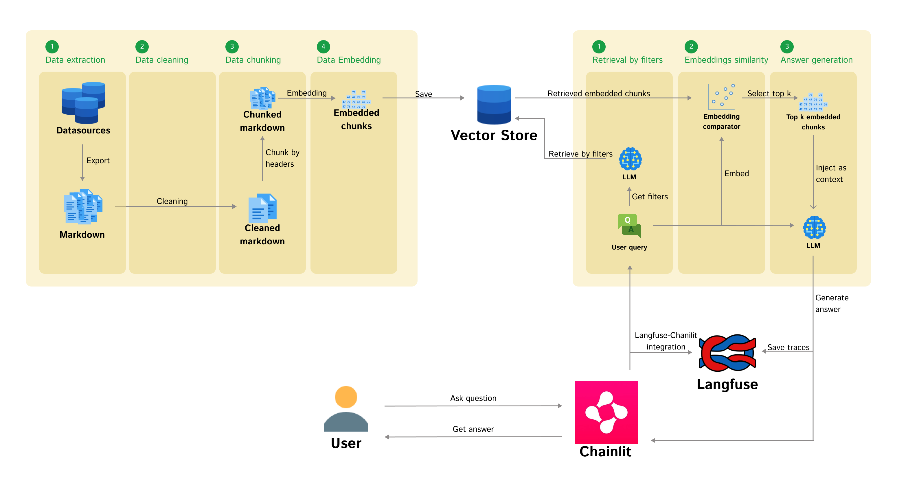

# RAG Blueprint

A comprehensive open-source framework for building production-ready Retrieval-Augmented Generation (RAG) systems. This blueprint simplifies the development of RAG applications while providing full control over performance, resource usage, and evaluation capabilities.

Open-source community offers a wide range of RAG-related frameworks focus on the specific area - monitoring, visualization or processing. While building or buying RAG systems has become increasingly accessible, deploying them as production-ready data products remains challenging. Our framework bridges this gap by providing a streamlined development experience with easy configuration and customization options, while maintaining complete oversight of performance and resource usage.

It comes with built-in monitoring and observability tools for better troubleshooting, integrated LLM-based metrics for evaluation, and human feedback collection capabilities. Whether you're building a lightweight knowledge base or an enterprise-grade application, this blueprint offers the flexibility and scalability needed for production deployments.


*Figure 1: High-level architecture of the RAG Blueprint framework showing the main components and data flow*

## 🚀 Features

- **Hybrid Retrieval**: Improved retrieval accuracy by combining semantic vector search and keyword-based (BM25) search with Query Fusion.
- **ColBERT Reranking**: Advanced post-processing using ColBERT reranker for superior precision in top results.
- **Multiple Knowledge Base Integration**: Seamless extraction from several Data Sources (Confluence, Notion, PDF).
- **Wide Models Support**: Availability of numerous embedding and language models.
- **Interactive Chat**: User-friendly interface for querying knowledge on [Chainlit](https://chainlit.io/).
- **Performance Monitoring**: Query and response tracking with [Langfuse](https://langfuse.com/).
- **Evaluation**: Comprehensive evaluation metrics using [RAGAS](https://docs.ragas.io/en/stable/).
- **Setup flexibility**: Easy and flexible setup process of the pipeline.

## 🛠️ Tech Stack

### Core
[Python](https://www.python.org/) • [LlamaIndex](https://www.llamaindex.ai/) • [Chainlit](https://chainlit.io/) • [Langfuse](https://langfuse.com/) • [RAGAS](https://docs.ragas.io/)

### Components
- **Retriever**: Basic Vector, Hybrid (Vector + BM25)
- **Postprocessor**: ColBERT Reranker, Metadata filters
- **LLMs**: OpenAI, Anthropic, HuggingFace, Local (via Ollama)

## 📖 Usage

### Prerequisites
Install dependencies:
```bash
pip install .[all]
```

### Basic Start
To start the Chainlit UI with the default configuration:
```bash
python -m src.augmentation.app --env default
```

### Hybrid Retrieval Start
To use the new Hybrid Retrieval with ColBERT reranking:
```bash
python -m src.augmentation.app --env hybrid
```

## ⚙️ Configuration

The project uses a modular configuration system based on Pydantic. Configuration files are located in the `configurations/` directory and are selected using the `--env` flag.

- `configuration.default.json`: Standard vector search
- `configuration.hybrid.json`: Hybrid search (Vector + BM25) with ColBERT reranking
