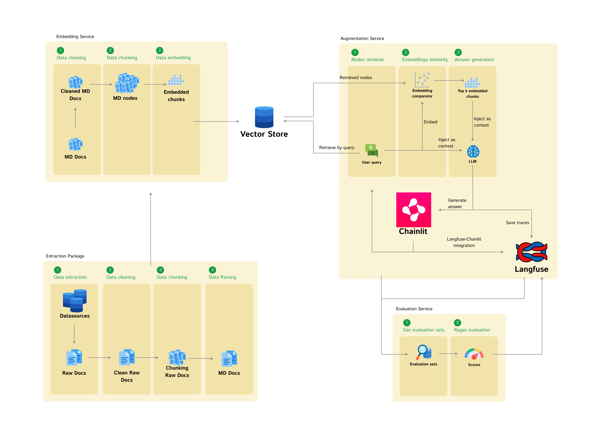

# RAG Blueprint

### Tech Stack

`python 3.12.2`
`llama-index`
`notion_exporter`
`langfuse`
`chainlit`
`ragas`

### Models

`nemo` `BAAI/bge-small-en`

### Access points

**Qdrant**

- Url: `http://localhost:6333/dashboard`
- Collection: `ragkb-*`

**Chat**

- Url: `http://localhost:8001`

**Langfuse**

- Url `http://localhost:3003`

# Build and Run

For detailed information read [Build](build/README.md) guide.

# Code structure

- `build` build pipelines.
  - `workstation` building pipelines dedicated for the workstation
    - `deploy` deployment scripts
    - `init` init scripts
    - `test` test scripts
    - `logs` build logs (generated during runtime)
- `env_vars` files with enviornment variables
- `res` general resources.
- `src` code sources.
  - `augmentation` sources regarding retrieval and augmentation process. Additionally
  handles UI of the chat.
    - `bootstrap` initialization and configuration files
    - `builders` contains different builders
    - `services` contains corresponding services
  - `common` sources that are shared among different parts of the system
    - ... analogical to `augmentation`
  - `embedding` sources regarding data extraction and embedding process.
    - ... analogical to `augmentation`
  - `evaluate` sources regarding the evaluation of the RAG system.
    - ... analogical to `augmentation`
  - `chat.py` entry script for UI chat
  - `embed.py` entry script for embedding confluence pages
  - `evaluate.py` entry script for evaluation of the RAG system.

# Architecture

<div align="center">
  
</div>

## Extraction

Content from the Notion page's are fetched through NotionAPI wrapped by slightly customized version of `notion_exporter` package. Notion pages are build of blocks, exporter fetches them, parses them to markdown and merge all together returning page's content in markdown format. The following metedata is extracted:
- title
- creation_time
- last_edited_time
- url
- type
- page_id
- parent_id

Due to the NotionAPI's rate limits throttling system is implemented controlled by `export_batch_size`, which indicates how many pages are exported in parallel. Smaller values slowers the process, however, saves us from rate limits problems. Additionally retry system is implemented. Due to other HTTP-related problems, some pages may fail to be exported, corresponding ids are logged.

Some of the migrated pages have `1970-01-01T00:00:00` assigned to the `creation_time` and `last_edited_time`, even though the Notion's UI displays migration date. Apparently, NotionAPI has some bug, and these pages are not returned by dedicated `search` endpoint. To work this around missing page ids are stored in `res/missing_page_ids`, which are appended to the pages that are found through the `search` endpoint during the extraction process.

Therefore, pages to be fetched are retrieved from the list of pages of the [Notion Homepage](https://www.notion.so/4c962a2467d44b8d9d25b235ed46ae92?v=66e1aa43f3c7481abd9dfecc90d4f5d1&pvs=4) and only suplemented by pages that are found by `search` endpoint exposed by Notion API.

## Cleaning

Blank pages, without any content, are removed. Databases parsed to markdown, contain verbose new line signs `\n`, which are removed from the markdown.

## Chunking

Docments are chunked by markdown headers where `MarkdownNodeParser` from `llama-index` is used.

## Embedding

For chunking embeddings `BAAI/bge-small-en` model is used.

## Vector database

For storing the embeddings `QDrant` database is used.

## Retrieval

### Filters

### Embedding similiraity

Filtered chunks' embeddings are comapred to embedded user query and top 5 chunks are returned.

## Augmentation

User communicates with the RAG system through the `chainlit` ecosystem that exposese ChatUI to the user. Previously retrieved top 10 chunks are used as the context and together with the user query are passed to LLM, which generates the final answer.

<div align="center">
  
</div>

For observability and evaluation `langfuse` component is introduced that keeps track of the traces produced during RAG retrieval and RAG generation. `Langfuse` and `chainlit` are separate systems with separete data layers. To associate their ids, each RAG answer's chainlit id is saved in corresponding langfuse record under `tags` column as `chainlit_message_id`. It is needed for **Human feedback** component.

For distinction all traces generated during evaluation are tagged by `chat_completion`.

## Evaluation


### Langfuse datasets

During the first startup, two datasets are used - `manual-dataset` and `feedback-dataset`- both can be found in the Langfuse UI under **Datasets** tab. `manual-dataset` is meant for the items that are added by the experts. It can be done through the UI **Datasets -> manual-dataset -> Items**, where the new items could be added. It should comply with the following format

**Input**

```json
{
  "query_str": "..."
}
```

**Output**

```json
{
  "result": "..."
}
```

`feedback-dataset` is automatically populated by Human feedback that is explained later on. Every feedback that is positive is uploaded to this dataset.

For evaluation different metrics from **Ragas** package are used:

- Faithfulness
- Answer Relevancy
- Context Precision
- Context Recall
- Harmfulness

More information about these metrics can be found [here](https://docs.ragas.io/en/latest/concepts/metrics/index.html). Evaluation is run after every deployment, however, it can be triggered manually by executing `python src/evaluate.py` command. All the results are visible Langfuse UI.

For distinction all traces generated during evaluation are tagged by `deployment_evaluation`.

### Human feedback

<div align="center">
  
</div>

`Chainlit` implements human-feedback feature that allows us to save feedback from the users. For the integration with `Langfuse` tracing and scoring functionalities scores feeback is passed from `Chailit` to `Langfuse`. In this process `chainlit_message_id` is used. All gathered data can be found on `Langfuse` dashboard.
